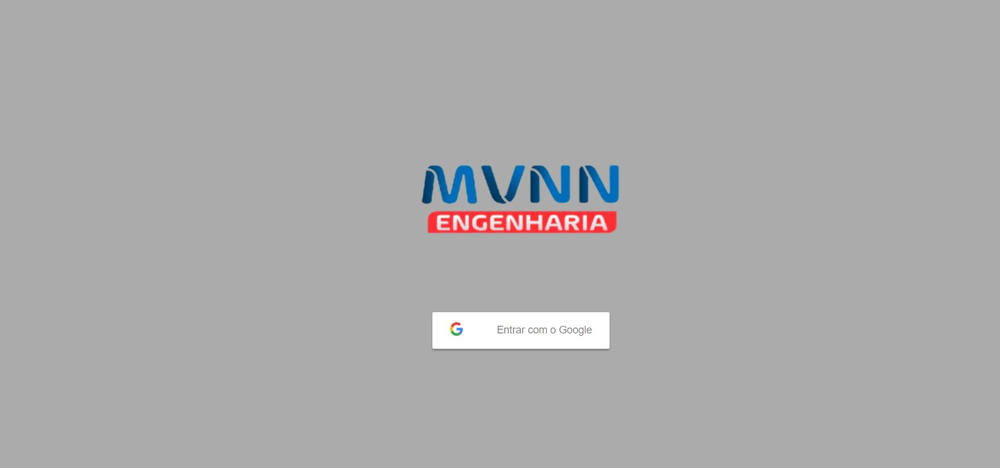
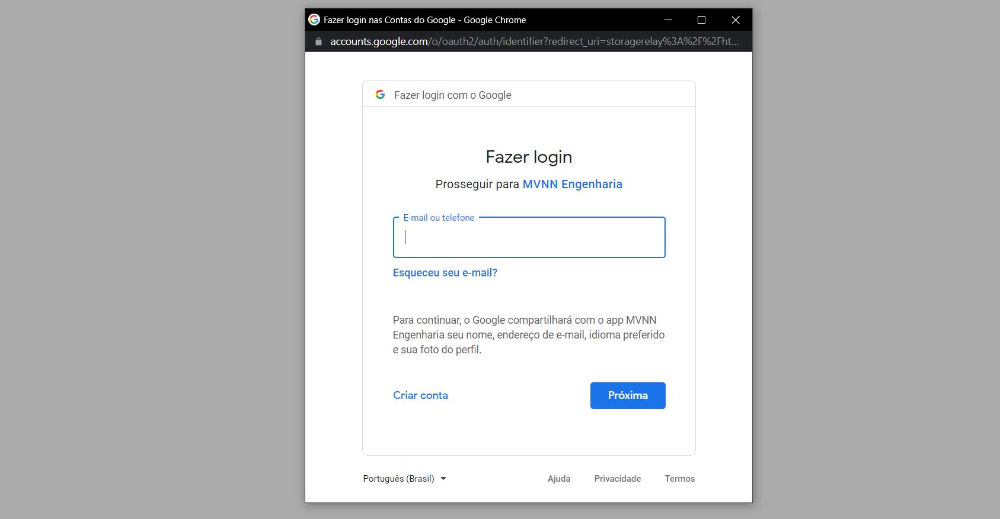
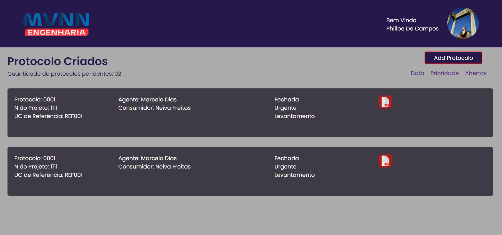
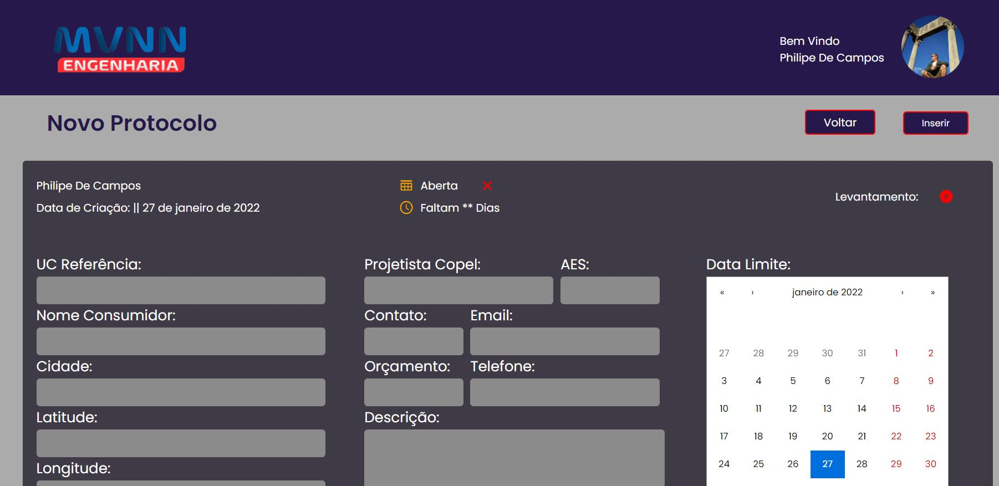
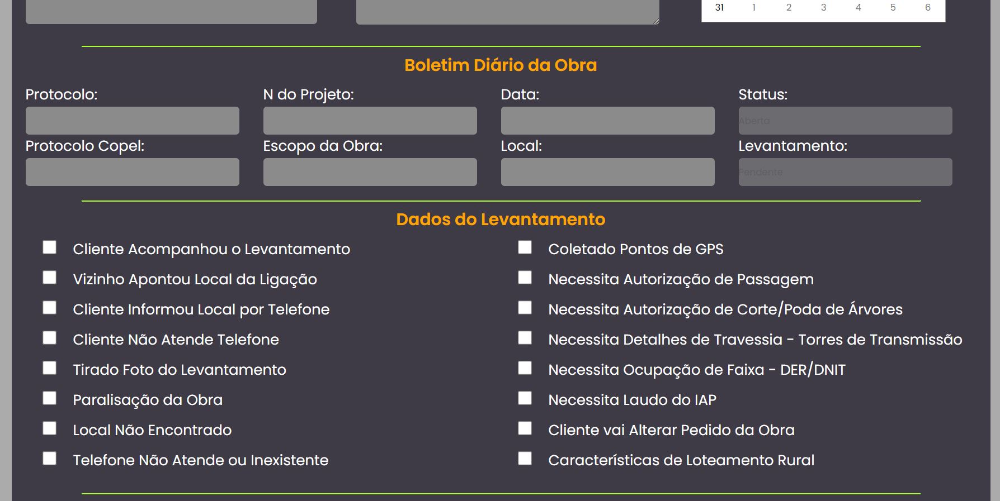
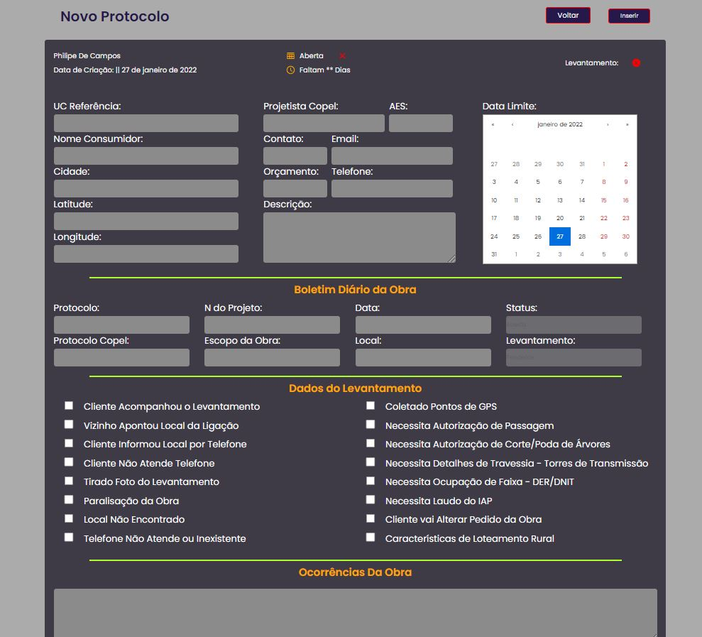

# MVJS
This project is still being assembled together with the client where work surveys will be inserted.

## The challenge
The biggest problem of this project was to fit the long form to the layout built by the client.
With this process completed we will move on to the next step, to send the data to an API.

## MongoDB
The noSQL Database will be used because the information does not have relationships with each other. It will just be data being populated in the forms.

## Login with Google
The type of Login with Google was chosen, as we will not have a database with sensitive user information.
This type of approach allows only emails previously registered in the Google Login API to work in the application.

## Waiting...
There is a version of the project here on github with private protection. The project is stopped because it depends on the client's continuation.
The private version has styled-components styles and development in Typescript.

## Checking the project

